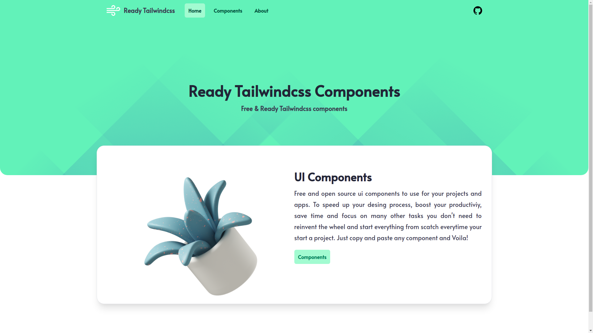

# Ready TailwindCss

## Vue 3 + Vite

This template should help get you started developing with Vue 3 in Vite. The template uses Vue 3 `<script setup>` SFCs, check out the [script setup docs](https://v3.vuejs.org/api/sfc-script-setup.html#sfc-script-setup) to learn more.

## Recommended IDE Setup

- [VSCode](https://code.visualstudio.com/) + [Volar](https://marketplace.visualstudio.com/items?itemName=johnsoncodehk.volar)

## Contribution
how to contribute?
Any kind of contribution are welcome. You develop the website, add components, add documentations.

- fork the repository
- clone it to your computer
- make changes 
- commit changes
- make PR (pull request)

#### Components
- Under the <b>src / views / components</b> create a new folder with name describes the components
- Create new vue components 
- Use only Tailwindcss style
- Add <b>template</b> code to <b>components.json</b>
- Add your components in <b>components / index.vue</b>
- Add your github informations to <b>about / contributors.json</b>

#### Website
- Any improvements / upgrade / fix

#### Documenation
- Better documentations